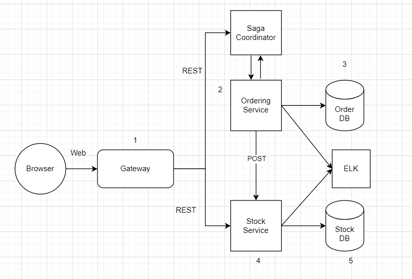

# Laboratory work Nr.1

**Online grocery platform (ex: Amazon)**

If you want to run this project, firstly:

You need to have installed Zookeeper.

on Windows:

first run from cmd ../zookeeper bin/ 
> zkServer.sh start

run from bash 
> netstat -an | grep 2181

expected output (zk started):
> TCP    0.0.0.0:2181           0.0.0.0:0              LISTENING

> TCP    [::]:2181              [::]:0                 LISTENING

In order to terminate zk from cmd ../zookeeper/bin/  > zkServer.sh stop   


In order to run the **images** run the following commands:

1. 
```
docker network create my_network
```

2. 
```
docker run --name gateway --network my_network -p 4000:4000 -e SERVICE_DISCOVERY_URL=http://service_discovery:4001 sergheicovtun/pad_lab_1:gateway
```
3. 
```
docker run --name stock_service --network my_network -p 5000:5000 sergheicovtun/pad_lab_1:stock
```
4. 
```
docker run --name ordering_service --network my_network -p 5001:5001 sergheicovtun/pad_lab_1:ordering
```

Take into consideration that by running gateway.js, you running service_discovery as well, so you don't need to run service_discovery.js separately.

**DB note:**

In order to work with DB you should have PostgreSQL database which u cane create with following command:
```
CREATE TABLE bills (
    bill_id SERIAL PRIMARY KEY,
    item VARCHAR(255),
    seller VARCHAR(255),
    quantity INTEGER,
    address VARCHAR(255),
    card_number VARCHAR(255),
    price REAL,
    usd REAL
);
```

Also make sure you have the "db_config.json" file with following info:
```
{
  "db_name": your_db_name,
  "user": your_username,
  "password": your_password,
  "host": your_host, // default value could be "localhost"
  "port": your_port, // default value could be "5432"
}
```


## Assess Application Suitability

#### Scalability
Microservices allow you to scale individual components of your online grocery store independently based on demand. For example, during holiday seasons or special promotions, the order processing service can be scaled up without affecting other services.

#### Faster Development: 
Microservices enable faster development cycles as each component can be developed independently by different teams.

#### Improved Fault Isolation: 
Isolating different services means that if one service fails, it won't necessarily bring down the entire system. This leads to improved fault tolerance and better user experience.

#### Technological Diversity: 
Different services can use the most appropriate technology stack for their specific task, which can lead to improved performance and efficiency.

#### Continuous Deployment: 
Microservices facilitate continuous deployment and delivery, allowing you to release updates and features more frequently without disrupting the entire system.

#### Adaptability to Changing Requirements: 
Online grocery stores often face changing customer preferences and market trends.

#### Third-Party Integration:
Microservices make it easier to integrate with third-party services and APIs, such as payment gateways or mapping services, which is crucial for a seamless user experience.

## Define Service Boundaries

#### Ordering Service
- Building the bill 
- Sending a bill to the user
- Make default order
- Make an order from the specified seller
- Sending data to the Stock service
- Saving/getting data from Ordering DB

#### Stock Service
- Showing grocery catalog
- Updating stock
- Searching through a catalog
- Adding grocery to the catalog
- Sending data to the Ordering service 
- Saving/getting data from Stock DB

## Choose Technology Stack and Communication Patterns
- Gateway: JS
- Microservices & DB: - Python, Flask, PostgreSQL, Non-relational DB
- Communication: RESTful APIs


## Design Data Management

### Ordering Service

**/create_order POST**
> url: http://localhost:4000/order/create_order JSON 
```
request: { 
           "item": "apple",
           "quantity": 5,
           "address": "Florida, Ancr Str, bd 14",
           "card_number": 1234123412341234
          }
```
> Response
> JSON

```
payload: { 'status': 'Order has been sent!',
           "bill_id": 1,
           "item": "apple",
           "seller": Stock
           "quantity": 5,
           "price": 2,
           "usd": 10.0,
           "address": "Florida, Ancr Str, bd 14",
           "card_number": 1234123412341234,
           "status": "sent"
          }
```

> url: http://localhost:4000/order/create_order JSON 
```
request: { 
           "item": "apple",
           "seller": John
           "quantity": 2,
           "address": "Florida, Ancr Str, bd 14",
           "card_number": 1234123412341234
          }
```
> Response
> JSON

```
payload: { 'status': 'Order has been sent!',
           "bill_id": 1,
           "item": "apple",
           "seller": John
           "quantity": 5,
           "price": 4.5,
           "usd": 22.5,
           "address": "Florida, Ancr Str, bd 14",
           "card_number": 1234123412341234,
           "status": "sent"
          }
```

**/status GET**
> url: http://localhost:4000/order/status
> empty request

> Response:
```
{'status': 'Healthy'}
```


### Stock Service

**/show_stock GET**
> url: http://localhost:4000/stock/show_stock
> empty request

> Response
> JSON

```
{
    "apple": {
        "seller-Stock": {
            "quantity": 972,
            "price": 2,
            "seller": "Stock"
        },
        "seller-John": {
            "quantity": 2,
            "price": 4.5,
            "seller": "John"
        }
    },
    "banana": {
        "seller-Stock": {
            "quantity": 1000,
            "price": 4,
            "seller": "Stock"
        }
    },
    "potato": {
        "seller-Stock": {
            "quantity": 1000,
            "price": 3.5,
            "seller": "Stock"
        }
    },
    "tomato": {
        "seller-Stock": {
            "quantity": 1000,
            "price": 2.8,
            "seller": "Stock"
        }
    }
}
```


**/search GET**
> url: http://localhost:4000/stock/search
> request JSON 
```
request: {"find_all" : "apple"}
```
> Response
> JSON

```
"seller-Stock": {
  "quantity": 972,
  "price": 2,
  "seller": "Stock"
  },
"seller-John": {
  "quantity": 2,
   "price": 4.5,
  "seller": "John"
}
```

**/add_item POST**
> url: http://localhost:4000/stock/add_item
> JSON 
```
request: {"apple": {
           "seller-Alex": {
           "quantity": 5,
           "price": 4.50,
            }
           }
          }
```
> Response
> JSON

```
payload: { "success": True}
```

**/update_stock POST, internal endpoint** 
> url: http://localhost:4000/stock/update_stock
> JSON 
```
{
  "current_seller" : "Stock", 
  "item": "apple", 
  "quantity" : 5
}
```
> Response
> JSON

```
payload: "Data sent successfully!"
```

**/status GET**
> url: http://localhost:4000/stock/status
> empty request

> Response:
```
{'status': 'Healthy'}
```

### Gateway
Use:
```
http://localhost:4000/stock/...

http://localhost:4000/order/...
```

In order to communicate with microservices.

**/status GET**
> url: http://localhost:4000/status
> empty request

> Response:
```
{'status': 'Healthy'}
```

## Service_discovery

**/status GET**
> url: http://localhost:4001/status
> empty request

> Response:
```
{'status': 'Healthy'}
```


## Set Up Deployment and Scaling

**Containerization with Docker:**

- Containerization of Microservices: Each microservice will have its Docker container. 
- Dockerfile: Dockerfiles for each microservice. This file contains instructions to build a Docker image, including the base image, dependencies installation, and application setup.
- Building Docker Images: Using the Dockerfile to build Docker images for each microservice. 

**Container Orchestration:**
- Kubernetes is a good choice for container orchestration. Kubernetes is a powerful tool for managing Docker containers in a production environment. It provides features like automated scaling, load balancing, and rolling updates.

OR

- Docker Compose (for Development): While Kubernetes is excellent for production, Docker Compose is useful for local development and testing. It allows you to define and run multi-container applications using a single YAML file.

**Deployment:**

Continuous Integration/Continuous Deployment (CI/CD): Implementation of a CI/CD pipeline to automate the deployment process. (Tools like Jenkins, GitLab CI/CD, or Travis CI)

**Scaling:**

- Horizontal Scaling: Microservices can be independently scaled horizontally to handle increased load. Kubernetes, for example, provides auto-scaling capabilities based on metrics like CPU utilization and incoming traffic.
- Load Balancing: Using load balancers to distribute traffic evenly among multiple instances of the same microservice. Kubernetes has built-in load-balancing features and also can be used with external load balancers like AWS Elastic Load Balancing or Nginx.

